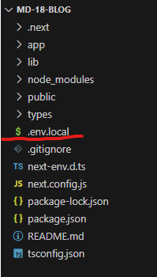

This is a [Next.js] project: My Blog for MD 18.

## First Things first

First, install dependancies:

```bash
npm i
```

Second, run the development server:

```bash
npm run dev
```

Third: create file named .env.local like so:



and inside should be: 
MONGODB_URI = (link to your mongoDB)

Open [http://localhost:3000] with your browser to see the result.

## Client side pages (accessible through page naviagtions):

Home: [http://localhost:3000]

Tag pages:
[http://localhost:3000/entertainment]
[http://localhost:3000/exotic]
[http://localhost:3000/health]
[http://localhost:3000/educational]

About page: [http://localhost:3000/about]

## Admin side pages (few accesible only with links, others via naviagtion):

Login page: [http://localhost:3000/login] (credentials currently not working)

Main page(with navigation): [http://localhost:3000/main]

All Posts page: [http://localhost:3000/all] - see all posts here with option to delete (WIP) and edit (WIP) posts.

All Comments page: [http://localhost:3000/comments] - see all comments here with option to delete (WIP) comments.

Create Post page: [http://localhost:3000/create]

## WIP List

1. Edit function on Posts.
2. Delete function on Posts.
3. Delete function on Comments.
4. Add authentification.
5. Adding React-Draft-Wysiwyg for advanced post text creation.

## Project structure

- (blogs) - page routes to client side pages. See **## Admin side pages**
- (components) - self explanatory.
- (create) - page routes to admin side pages. See **## Client side pages**
- api - includes routes to:
  1. auth
  2. blog
  3. comment
  4. user
- lib - includes:
  1. Schema models for mongoose
  2. Mongo connection
  3. Service for nextAuth(WIP)
- types - defining types for nextAuth (WIP) and MONGODB.
- env.local - NEXTAUTH_SECRET, NEXTAUTH_URL and MONGODB_URI.
- next.config.js = added domains for image usage. Check NextJS documentation on how to add domains for <Image>.

## Extensions used
- Prettier

## Learn More

To learn more about Next.js, take a look at the following resources:

- [Next.js Documentation](https://nextjs.org/docs) - learn about Next.js features and API.
- [Learn Next.js](https://nextjs.org/learn) - an interactive Next.js tutorial.

You can check out [the Next.js GitHub repository](https://github.com/vercel/next.js/) - your feedback and contributions are welcome!
